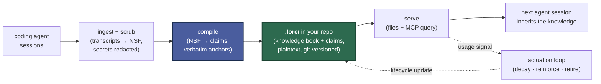

# crewlore

[](https://github.com/srijansk/crewlore/actions/workflows/ci.yml)
[](https://opensource.org/licenses/MIT)
[](https://github.com/srijansk/crewlore/tree/main/docs/examples/pydantic-ai/)
[](https://github.com/srijansk/crewlore/tree/main/docs/examples/pydantic-ai/)

> **Your coding agents keep relearning what your team already figured out.**
> `crewlore` compiles agent sessions into a citable, plaintext team-knowledge layer that lives in your git repo. Local-first.

<p align="center">
  
</p>

```bash
pipx install crewlore
```

> **Validated on [`pydantic/pydantic-ai`](https://github.com/pydantic/pydantic-ai)** (17.3k ⭐) · 3 sessions · 18 claims · 100% fidelity · [see receipts →](https://github.com/srijansk/crewlore/tree/main/docs/examples/pydantic-ai/)

## Quickstart

```bash
cd my-repo
lore init                      # create .lore/ in your repo
lore watch                     # automatic: read agent transcripts, scrub secrets,
                               #   compile to claims, prune — on an interval
lore query "billing webhook"   # ask the knowledge layer anything, anytime
```

That's it — engineers keep working in whatever agent they use; `lore` keeps the knowledge layer fresh in the background. Commit `.lore/knowledge` and `.lore/claims` and your teammates inherit it on the next `git pull`.

<details>
<summary>Trouble installing?</summary>

If `pipx` fails with `Broken Python installation, platform.mac_ver() returned an empty value`, your default Python is a broken install (sometimes seen with very recent Homebrew Python 3.14 builds). This is about the interpreter pipx uses, not the package — pin a known-working one:

```bash
pipx install --python python3.13 crewlore
```

To make pipx default to Python 3.13 going forward: `export PIPX_DEFAULT_PYTHON=$(which python3.13)`.

</details>

### Try it in 30 seconds — no API key

```bash
git clone https://github.com/srijansk/crewlore.git
cd crewlore && uv run python scripts/demo.py
```

The demo runs the full loop on bundled public-safe sessions and prints what it found:

> [!NOTE]
> **Fidelity — 100%.** Every claim's citation resolves verbatim back to its source.
> **Conflicts surfaced — 1.** A real disagreement kept with both provenances, not silently merged.
> **Preventable rediscovery — 2 of 3.** Two of the three held-out follow-up sessions re-derived knowledge the layer already had. (Illustrative demo data — n=3, not a benchmark.)

## See it run on a real codebase: pydantic-ai (17.3k ⭐)

[`docs/examples/pydantic-ai/`](https://github.com/srijansk/crewlore/tree/main/docs/examples/pydantic-ai/) is a committed snapshot of `crewlore` compiled on the public [`pydantic/pydantic-ai`](https://github.com/pydantic/pydantic-ai) repo — 3 Claude Code sessions on real issues, no synthetic data.

- **18 claims** compiled across 9 scope groupings (UI adapters, decorator introspection, durable-execution threat modeling, toolsets, tests, version policy)
- **100% fidelity** under the explicit [canonical-form contract](https://github.com/srijansk/crewlore/blob/main/docs/anchors.md) — every anchor's quote canonically resolves to a substring of its source session. (Fidelity certifies the *citation* is real, not that the model's *statement* is fully entailed by it — that's what human/PR review of the book is for.)
- **0 conflicts** because the three sessions covered disjoint scopes — the conflict detector wasn't given anything to flag
- **Receipts:** the rendered [`book.md`](https://github.com/srijansk/crewlore/blob/main/docs/examples/pydantic-ai/book.md), the raw [`claims.jsonl`](https://github.com/srijansk/crewlore/blob/main/docs/examples/pydantic-ai/claims.jsonl), and full [`provenance.md`](https://github.com/srijansk/crewlore/blob/main/docs/examples/pydantic-ai/provenance.md) (session ids, commit hashes, compile cost, scrub redactions, five real-data bugs the capture surfaced and we fixed before publishing)

## What you get

Raw, messy sessions go in. Out comes a structured, citable **compiled claim** — every one carrying its kind, its scope, the action it implies for future work, and a verbatim **anchor** back to the moment it was discovered:

> **`[gotcha]`** · *services/billing*
>
> Billing webhook handler lacks an idempotency check, causing duplicate charges when Stripe retries webhooks.
>
> **Do** — dedupe on the Stripe idempotency key before processing.
>
> > *anchor* — "the handler has no idempotency check, so when Stripe retries a webhook the charge is processed again."

A human can verify it (the anchor points back to the exact session line); an agent can trust it (the citation is real, not hallucinated). Claims roll up into a knowledge book at `.lore/knowledge/README.md`, grouped by area and committed to your repo alongside your code:

```markdown
# Team knowledge (compiled by crewlore)

## services/billing

- **[gotcha]** Billing webhook handler lacks an idempotency check; dedupe on the Stripe key.
  - *Do:* Dedupe on the Stripe idempotency key before processing.
  - _anchor_ `ses_1#1`: "the handler has no idempotency check, so when Stripe retries a webhook the charge is processed again."

## deployment

- **[procedure]** Run migrations before deploy to prevent missing columns.
  - *Do:* Run `make migrate` before every deploy.
```

## How it works



> `lore watch` runs ingest → compile → prune automatically, on an interval.

- **Ingest + scrub** — reads the coding agent's existing on-disk transcripts and redacts a curated set of secret patterns (Anthropic / OpenAI / generic `sk-*` API keys, AWS keys, GitHub classic + fine-grained PATs, Google API keys, Slack tokens, HuggingFace tokens, JWTs, connection-string passwords, private-key blocks, and `password=…` assignment shapes) *before* anything is stored or sent to a model. The pattern set is documented in [`docs/scrub.md`](https://github.com/srijansk/crewlore/blob/main/docs/scrub.md).
- **Compile** — extracts atomic claims, deduplicates them, records disagreements instead of silently overwriting, scores authority by how often a claim recurs, and drops any claim whose citation doesn't resolve verbatim.
- **Serve** — writes a human- and agent-readable knowledge book to `.lore/knowledge/`, and exposes a query tool (including an optional MCP server) so any agent can pull the relevant slice on demand.
- **Actuation loop** — every retrieval is recorded, and that usage drives a lifecycle: unused claims decay and archive, contradicted claims are retired, useful claims are reinforced. The store stays small and fresh instead of growing into a pile nobody reads.

The intelligence is in **compile**; ingest and serve are deliberately thin, so supporting another coding agent is a small adapter, not a rewrite. To be precise about the word "compile": extraction is an LLM step (the only non-deterministic part), wrapped in deterministic stages — verbatim-anchor verification, content-addressed dedup, conflict recording, and authority scoring. "Compile" means the repeatable session → claims transform, not that an LLM is absent.

## How it differs

- **vs. hosted memory (Letta, mem0)** — their store lives in someone else's cloud and you can't `git log` it; `crewlore`'s lives in your repo as plaintext.
- **vs. per-IDE memory (Cursor rules, Claude memory, Continue, Cody)** — tied to one developer, one IDE; `crewlore` is a *team* artifact, committed and reviewed like code.
- **vs. hand-curated `CLAUDE.md` / `.cursorrules`** — humans write those by hand and they go stale; `crewlore` compiles + reinforces from real sessions and retires what stops being used.
- **vs. RAG over a vector DB** — RAG retrieves *document chunks*; `crewlore` compiles atomic, citable *claims* with verbatim anchors, so a human or agent can verify the cited source in seconds. (Retrieval today is deterministic lexical overlap, not embeddings — simpler and dependency-free; semantic ranking is on the roadmap.)

## Why this exists

Knowledge discovered inside an agent session is private by default and lost by default. It lives in one developer's transcript, so the next engineer — and every future agent run — re-reads the same files, re-learns the same gotcha, and re-makes a decision the team already made. There's no shared layer that both humans and agents read from, so decisions drift and bugs resurface.

`crewlore` makes that knowledge a first-class, versioned artifact in the place your team already trusts: your git repo.

**What it is:** a compiler that turns sessions into accurate, deduplicated, conflict-aware, provenance-carrying team knowledge, served back to any agent.

**What it isn't:** a hosted service, a vector database, or a personal-memory layer for a single IDE. There's no account, no cloud, and no proprietary store — the compiled knowledge is plaintext you own.

## Your data stays yours

- **Local-first.** Capture, compile, and serve all run on infrastructure you control. Point the compiler at your own model provider or a local OpenAI-compatible model (Ollama, LM Studio, vLLM) via `provider: local` — nothing routes through any `crewlore`-operated service, because there is none.
- **Plaintext, in your repo.** The knowledge layer is human-readable Markdown and JSONL under `.lore/`, versioned by git. `git log .lore/` is your audit trail.
- **Secrets never travel.** Scrubbing — of both message content and tool-call arguments — happens at ingest, before storage or any model call. It's a high-precision pattern set (a floor, not a DLP guarantee; see [`docs/scrub.md`](https://github.com/srijansk/crewlore/blob/main/docs/scrub.md)), and raw session captures are git-ignored by default regardless.

## CLI

| Command | What it does |
|---|---|
| `lore init` | Create the `.lore/` layout in your repo. |
| `lore watch` | Automatically ingest → compile → prune on an interval (`--once` for cron/CI). |
| `lore compile` | Run a single ingest-and-compile pass manually. |
| `lore query "<task>"` | Retrieve the claims most relevant to a task (records usage). |
| `lore status` | Show claim/conflict counts and how much of the layer is actually being used. |
| `lore serve --mcp` | Start an MCP server exposing query-time retrieval to any MCP-speaking agent (Claude Desktop, Cursor, …). Requires `pip install 'crewlore[serve]'`. See [`docs/mcp.md`](https://github.com/srijansk/crewlore/blob/main/docs/mcp.md) for wiring snippets. |

## Configuration

`.lore/config.yaml`:

```yaml
model:
  provider: anthropic          # anthropic | openai | local
  name: claude-sonnet-4-6
  # For provider: local — point at any OpenAI-compatible endpoint you run:
  # base_url: http://localhost:11434/v1   # e.g. Ollama, LM Studio, vLLM
capture:
  transcripts: ~/.claude/projects
compile:
  cadence: auto                # `lore watch` interval below
  watch_interval_seconds: 300
```

Bring your own key (`ANTHROPIC_API_KEY` / `OPENAI_API_KEY`); `crewlore` never ships keys anywhere. The default Anthropic provider works out of the box. For OpenAI or a local OpenAI-compatible model, add the SDK: `pipx inject crewlore openai` (or `pip install 'crewlore[openai]'`). With `provider: local` nothing leaves your machine at all — the compile call hits your own endpoint.

## Roadmap & limitations

> [!NOTE]
> **Status: alpha.** The core is stable and tested end to end. The on-disk schema may change before 1.0 — and because everything is plaintext and git-versioned, breaking format changes will ship with migrations.

- **Stable today:** capture, secret scrubbing, the compile pipeline, retrieval, the actuation loop, and the `.lore/` plaintext format.
- **In flight:** cross-session conflict alignment — real disagreements are surfaced today, but reliably aligning claims about the same question across independently-compiled sessions is an active area of work.
- **Planned:** an explicit human approve-before-serve gate (secret scrubbing is already automated), more capture adapters beyond Claude Code, and a real-time capture hook.

## Contributing

Issues, discussions, and PRs welcome. New here? Start a [discussion](https://github.com/srijansk/crewlore/discussions) — adding a capture adapter for another coding agent is the most valuable first contribution and is intentionally small. See [CONTRIBUTING.md](https://github.com/srijansk/crewlore/blob/main/CONTRIBUTING.md) for local setup and the dev loop.

Tests are fully deterministic — no real API calls during `pytest`.

## License

MIT — see [LICENSE](https://github.com/srijansk/crewlore/blob/main/LICENSE).
