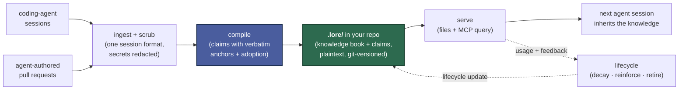

# crewlore

[](https://github.com/srijansk/crewlore/actions/workflows/ci.yml)
[](https://pypi.org/project/crewlore/)
[](https://pypi.org/project/crewlore/)
[](https://opensource.org/licenses/MIT)

> **Your coding agents keep relearning what your team already figured out.**
> `crewlore` reads the sessions your agents already produce, and your repo's pull requests, pulls out the decisions, procedures and gotchas, and writes them into a plain-text knowledge book inside your repo. Every entry quotes the exact line it came from, and records whether the team adopted it or tried it and declined. Runs on your machine with your own model key.

https://github.com/user-attachments/assets/457a7289-6591-4790-9e96-bc99c293b162

<p align="center">
  
</p>

```bash
pipx install crewlore
```

**You need:** Python 3.10 or newer; a model key (`ANTHROPIC_API_KEY` or `OPENAI_API_KEY`) or a local OpenAI-compatible model; the [GitHub CLI](https://cli.github.com/) (`gh auth login`) if you want to compile pull requests; [`uv`](https://docs.astral.sh/uv/) only for the no-key demo below.

## Quickstart

Two ways in, depending on where your team's knowledge currently lives.

**You already use Claude Code.** Point `lore` at the transcripts it writes to disk. By default it reads only this repo's own transcripts, never the other projects on your machine.

```bash
cd my-repo
export ANTHROPIC_API_KEY=...     # or OPENAI_API_KEY, or a local model in .lore/config.yaml
lore init                        # create .lore/ in your repo
lore watch                       # read this repo's transcripts, scrub secrets, compile, prune — on an interval
lore query "billing webhook"     # ask the knowledge layer anything, anytime
```

**You have a repo but no sessions yet.** Compile its pull-request threads instead. Coding agents write much of their reasoning in PR descriptions and reviews — what they tried, why it failed, which constraint they hit — so a repo nobody has run an agent in locally already has a knowledge layer waiting:

```bash
cd my-repo
export ANTHROPIC_API_KEY=...
lore init
lore import-prs owner/repo       # closed PRs by default, agent-authored only; uses your gh login, stores no token
lore query "billing webhook"
```

Either way, commit `.lore/knowledge` and `.lore/claims` and your teammates inherit the book on their next `git pull`. Raw transcripts and raw PR exports stay out of git.

<details>
<summary>Trouble installing?</summary>

If `pipx` fails with `Broken Python installation, platform.mac_ver() returned an empty value`, your default Python is a broken install (sometimes seen with very recent Homebrew Python builds). This is about the interpreter pipx uses, not the package — pin a known-working one:

```bash
pipx install --python python3.13 crewlore
```

To make pipx default to Python 3.13 going forward: `export PIPX_DEFAULT_PYTHON=$(which python3.13)`.

</details>

### Try it without an API key

```bash
git clone https://github.com/srijansk/crewlore.git
cd crewlore && uv run python scripts/demo.py
```

The demo runs the whole loop on bundled synthetic sessions and prints the compiled book, a query against it, and three checks. It is a demonstration of the mechanism on toy data, not a benchmark.

## What you get

Raw, messy sessions go in. Out comes a **claim**: one reusable thing the team learned, with four parts.

- **Kind** — a `decision`, `procedure`, `gotcha`, or `style` rule.
- **Action** — what a future session should do about it.
- **Anchor** — a verbatim quote from the source, plus where it sits (`<session>#event-<n>` for a transcript, `path:line` when a PR review comment supplies one). The compiler checks every quote against the source and drops any claim whose quote does not match, so the book never contains a citation that cannot be found.
- **Adoption** — `current`, or `not_adopted` when the team tried the thing and declined it.

> **`[gotcha]`** · *services/billing*
>
> Billing webhook handler lacks an idempotency check, causing duplicate charges when Stripe retries webhooks.
>
> **Do** — dedupe on the Stripe idempotency key before processing.
>
> > *anchor* `ses_1#event-3` — "the handler has no idempotency check, so when Stripe retries a webhook the charge is processed again."

**Declined work is recorded as declined.** When a session or pull request shows an approach was tried and not adopted, the claim says so, and its action says what to do instead:

> **`[decision · not adopted]`** · *services/billing*
>
> Storing the Stripe idempotency key in Redis was proposed and rejected in review because the check has to run inside the database transaction.
>
> **Instead** — keep the key in the same transaction as the charge.
>
> > *anchor* `services/billing/webhook.py:88` — "Don't put the key in Redis. Must be inside the transaction."

Why this matters: a memory schema that can only say "X" turns "we tried X and declined it" into a confident assertion of X — fluent, correctly quoted, and wrong about the world. The measurement behind this design is in [the study](#the-study-behind-the-adoption-field) below.

Claims roll up into a knowledge book at `.lore/knowledge/README.md`, grouped by area and committed to your repo alongside your code:

```markdown
# Team knowledge (compiled by crewlore)

## services/billing

- **[gotcha]** Billing webhook handler lacks an idempotency check; dedupe on the Stripe key.
  - *Do:* Dedupe on the Stripe idempotency key before processing.
  - _anchor_ `ses_1#event-3`: "the handler has no idempotency check, so when Stripe retries a webhook the charge is processed again."
- **[decision · not adopted]** Storing the idempotency key in Redis was proposed and rejected in review.
  - *Instead:* Keep the key in the same transaction as the charge.
  - _anchor_ `services/billing/webhook.py:88`: "Don't put the key in Redis. Must be inside the transaction."

## deployment

- **[procedure]** Run migrations before deploy to prevent missing columns.
  - *Do:* Run `make migrate` before every deploy.
```

## A real example

[`docs/examples/pydantic-ai-prs/`](https://github.com/srijansk/crewlore/tree/main/docs/examples/pydantic-ai-prs/) is `lore import-prs pydantic/pydantic-ai --limit 100`, run on 2026-10-09 against the public [`pydantic/pydantic-ai`](https://github.com/pydantic/pydantic-ai) repo (20k+ ⭐) with the default model, on a machine that had never run an agent in it. Of the last 100 closed pull requests, 24 were written by a coding agent: 18 merged, 6 closed without merging. They compiled into **130 claims**, 15 of them marked **not adopted**, carrying 173 anchors. The fidelity gate dropped none of the model's proposals, and an independent re-check of every anchor against the committed threads found none that fail to resolve. The scrubbed source threads are in the example, so every anchor can be followed to the event it quotes.

One claim from a merged pull request, where an alternative was tried and turned down inside the review:

> **`[decision · not adopted]`** · *pydantic_ai_slim/pydantic_ai/models*
>
> Unified prompt caching (`ModelSettings.cache` / `Caching`) stays opt-in. A default-on variant (`cache` defaulting to True on models with `supports_cache`) was tried and not adopted, because the maintainer deferred default-on caching to v3.
>
> **Instead** — do not default `cache` to True; leave caching off unless the user sets `cache`, uses `Caching()`, or sets a provider-specific cache setting. Revisit default-on only for v3.
>
> > *anchor* `pr_pydantic__pydantic-ai__7560#event-65` — "Per maintainer decision, caching stays off unless `cache` (or the `Caching` capability) or a provider-specific cache setting asks for it; turning it on by default waits for v3."

The directory also shows what the conflict detector does with claims that agree. The 0.4.0 run recorded one conflict: three claims that all say contributor PRs must not touch the repository's `.github/` directory, grouped as a disagreement because the detector then compared only scope, kind and topic. Since 0.4.2 a conflict needs evidence of disagreement (one claim marked not adopted while another is current, or one forbidding what another prescribes), and re-rendering the book from the committed claims records none. The blind spot that remains is listed under limits below.

The older snapshot, [`docs/examples/pydantic-ai/`](https://github.com/srijansk/crewlore/tree/main/docs/examples/pydantic-ai/), is three Claude Code sessions compiled with crewlore 0.1.0 in May 2026. Its README explains what it can and cannot show.

## How it works


```mermaid
flowchart LR
    S["coding-agent<br/>sessions"] --> I["ingest + scrub<br/>(one session format,<br/>secrets redacted)"]
    P["agent-authored<br/>pull requests"] --> I
    I --> C["compile<br/>(claims with verbatim<br/>anchors + adoption)"]
    C --> R["<b>.lore/</b> in your repo<br/>(knowledge book + claims,<br/>plaintext, git-versioned)"]
    R --> SV["serve<br/>(files + MCP query)"]
    SV --> N["next agent session<br/>inherits the knowledge"]

    SV -. "usage + feedback" .-> AL["lifecycle<br/>(decay · reinforce · retire)"]
    AL -. "lifecycle update" .-> R

    classDef engine fill:#4a5d9e,stroke:#1a2c4d,color:#fff,stroke-width:2px
    classDef artifact fill:#2d6a4f,stroke:#1b4332,color:#fff,stroke-width:2px
    class C engine
    class R artifact
```

- **Ingest + scrub.** Two sources feed one session format. *Transcripts:* the Claude Code session files for this repo. *Pull requests:* fetched through the `gh` CLI, one PR thread per session, carrying the description, commits and their messages, review comments with their file and line, approve or request-changes verdicts, CI results, and whether the PR merged or was closed. Both are scrubbed of a curated set of secret patterns (API keys, cloud and GitHub tokens, Slack and Hugging Face tokens, JWTs, connection-string passwords, private-key blocks, `password=…` shapes) before anything is stored or sent to a model. The pattern set and its limits are in [`docs/scrub.md`](https://github.com/srijansk/crewlore/blob/main/docs/scrub.md).
- **Compile.** A model extracts candidate claims from each session. Deterministic stages then do the rest: verify every anchor quote against the source and drop what does not match, derive each anchor's position from where the quote was found, deduplicate by content, record disagreements between sessions instead of overwriting, and score authority by how many independent sessions support a claim. `lore compile` prints how many proposed anchors and claims the gate dropped each pass; that number, not the store's after-the-fact "fidelity", is what tells you how the model behaved.
- **Serve.** A Markdown book in `.lore/knowledge/`, a `lore query` command, and an optional MCP server so any agent can pull the relevant slice at the start of a session.
- **Lifecycle.** Every retrieval is recorded. People and agents can mark claims influential or overridden (`lore feedback`, or the `lore_feedback` MCP tool). Claims nobody has read in 30 days (configurable) are archived, claims that are repeatedly overridden are retired, and influential ones are reinforced, so the book stays small instead of growing into a pile nobody reads. Usage is tracked per machine; the usage file is local so the committed book stays byte-stable.

The intelligence is in compile; ingest and serve are deliberately thin, so supporting another coding agent or another source is a small adapter, not a rewrite. "Compile" here means the repeatable session-to-claims transform: one model call per session, wrapped in deterministic verification, dedup, conflict recording and scoring.

## How it differs

- **vs. memory services with their own store** — their knowledge lives in a database you reach through an API. `crewlore`'s lives in your repo as plaintext: reviewed in pull requests, searched with grep, audited with `git log`.
- **vs. per-editor memory** — tied to one person and one tool. `crewlore`'s book is a team artifact that a new teammate gets on `git pull`.
- **vs. a hand-written `CLAUDE.md` or rules file** — written after the fact and stale within weeks. `crewlore` extracts from what actually happened, keeps the quote as proof, and retires what stops being read.
- **vs. retrieval over document chunks** — returns passages. `crewlore` returns claims with an action and a verdict, so a reader can tell a decision from a rejected alternative. (Retrieval today is deterministic word overlap, not embeddings — simpler and dependency-free; semantic ranking is on the roadmap.)

## Why this exists

Knowledge discovered inside an agent session is private by default and lost by default. It lives in one developer's transcript, so the next engineer — and every future agent run — re-reads the same files, re-learns the same gotcha, and re-makes a decision the team already made. There's no shared layer that both humans and agents read from, so decisions drift and bugs resurface.

`crewlore` makes that knowledge a first-class, versioned artifact in the place your team already trusts: your git repo.

**What it is:** a compiler that turns sessions and pull requests into deduplicated, conflict-aware, provenance-carrying team knowledge, served back to any agent.

**What it isn't:** a hosted service, a vector database, or a personal-memory layer for a single IDE. There's no account, no cloud, and no proprietary store — the compiled knowledge is plaintext you own.

## Your data stays yours

- **Local-first.** Capture, compile, and serve all run on infrastructure you control. Point the compiler at your own model provider or a local OpenAI-compatible model (Ollama, LM Studio, vLLM) via `provider: local` — nothing routes through any `crewlore`-operated service, because there is none.
- **Scoped by default.** `lore compile` and `lore watch` read only this repo's own Claude Code transcripts. Reading any other directory is an explicit choice (`--transcripts DIR` or `capture.transcripts` in the config).
- **Plaintext, in your repo.** The knowledge layer is human-readable Markdown and JSONL under `.lore/`, versioned by git. `git log .lore/` is your audit trail.
- **Secrets are scrubbed before storage.** Scrubbing of message content and tool-call arguments happens at ingest, before the session is written and before any model call. It is a high-precision pattern set, a floor rather than a DLP guarantee (see [`docs/scrub.md`](https://github.com/srijansk/crewlore/blob/main/docs/scrub.md)). Review the `.lore/` diff in a pull request like any other change.
- **Raw captures never reach git.** `.lore/sessions/`, `.lore/sources/` (raw PR exports), the extraction cache and the usage file are gitignored, and the ignore file is written on every store write, not only by `lore init`.
- **No tokens to store.** Pull-request import goes through the `gh` CLI you already authenticated; `crewlore` never sees or stores a GitHub token.

## CLI

| Command | What it does |
|---|---|
| `lore init` | Create the `.lore/` layout in your repo. |
| `lore watch` | Automatically ingest → compile → prune on an interval (`--once` for cron/CI). |
| `lore compile` | Run a single ingest-and-compile pass manually (`--rebuild` to re-extract everything). |
| `lore import-prs OWNER/REPO` | Compile a GitHub repository's pull-request threads. Scans closed PRs by default (`--state open` or `all`), agent-authored only (`--all-authors` for every PR), most recently updated first (`--limit N`). Needs the `gh` CLI. |
| `lore query "<task>"` | Retrieve the claims most relevant to a task, with their ids (records usage). |
| `lore feedback <id>… --influential` / `--overridden` | Tell the layer whether served claims helped. Feeds the lifecycle. |
| `lore status` | Show claim/conflict counts and how much of the layer is actually being read. |
| `lore serve` | Start an MCP server exposing `lore_query` and `lore_feedback` to any MCP-speaking agent (Claude Desktop, Cursor, …). Requires the `serve` extra. See [`docs/mcp.md`](https://github.com/srijansk/crewlore/blob/main/docs/mcp.md). |

## Configuration

`.lore/config.yaml`:

```yaml
model:
  provider: anthropic          # anthropic | openai | local
  name: claude-sonnet-5-5      # any current Claude model works; nothing but the prompt is sent
  # temperature: 0             # only sent if set; current Claude models reject sampling parameters
  # base_url: http://localhost:11434/v1   # for provider: local — Ollama, LM Studio, vLLM
capture:
  transcripts: auto            # this repo's own Claude Code transcripts, or a directory path
compile:
  watch_interval_seconds: 300
  max_unused_days: 30          # claims nobody reads for this long are archived
```

Bring your own key (`ANTHROPIC_API_KEY` / `OPENAI_API_KEY`); `crewlore` never ships keys anywhere. The default Anthropic provider works out of the box. For OpenAI or a local OpenAI-compatible model, add the SDK: `pipx inject crewlore openai` (or `pip install 'crewlore[openai]'`). With `provider: local` nothing leaves your machine at all. A rejected key, an unknown model name, or a parameter the model refuses stops the run with a clear error instead of reporting a successful compile of nothing.

## The study behind the adoption field

Before the adoption field existed, I measured what the compiler stores when it reads work a team declined, using agent-authored pull requests from the public [AIDev](https://arxiv.org/abs/2602.09185) corpus: 60 PRs closed without merging and 60 merged PRs from the same repositories, each claim judged by a separate model against the PR's actual outcome.

| | Declined PRs with ≥1 claim stating the rejected approach as current practice |
|---|---|
| crewlore's extractor, no change | 44.7% |
| A schema-free summarizer on the same threads | 47.6% |
| Merged controls | 0% |
| Tell the model the PR was closed | −14.6 points |
| Add the adoption field plus an instruction to use it | a further −12.7 points |

The part that changed the schema: across every version without the field, 0 of 867 extracted statements mentioned the rejection in their own text. With the field, 85% of the claims it marked `not_adopted` say so in words. Telling the model was not enough; it needed somewhere to write it down.

The code, pinned data revision and reproduction recipe are in [`studies/palm/`](https://github.com/srijansk/crewlore/tree/main/studies/palm/). The study ran crewlore's extractor and fidelity gate with Gemini models through the OpenAI-compatible provider, with a second judge for agreement (κ = 0.92). This repository is the primary record of the study; a short write-up is being posted as a preprint and will be linked here. If `crewlore` is useful in your research, [`CITATION.cff`](https://github.com/srijansk/crewlore/blob/main/CITATION.cff) has the citation.

## Status, limits and roadmap

> [!NOTE]
> **Alpha.** The on-disk format may change before 1.0; format changes are listed in the [CHANGELOG](https://github.com/srijansk/crewlore/blob/main/CHANGELOG.md). Tested on Python 3.10–3.14, with no network calls in the test suite.

- **Works today:** capture from Claude Code transcripts and GitHub pull-request threads, secret scrubbing, the compile pipeline (verbatim-anchor gate, derived anchor positions, adoption field, conflict recording, authority scoring), the book, `lore query`, the MCP server, feedback, and unused-claim decay.
- **Limits worth knowing:** retrieval is word overlap, not embeddings; the only transcript source is Claude Code (Cursor, Codex and Copilot sessions come in through the PR path); commits outside a pull request are not read; there is no approve-before-serve gate, so review the `.lore/` diff in a PR; the conflict detector flags a disagreement only when one claim is marked not adopted or forbids what another prescribes, so two sessions that merely pick different answers go unflagged; usage and decay are per machine, not shared across the team.
- **Planned:** a human approve-before-serve gate, transcript adapters for other coding agents, embedding-based retrieval, a real-time capture hook, and a shared usage signal across teammates.

## Contributing

Issues, discussions, and PRs welcome. New here? Start a [discussion](https://github.com/srijansk/crewlore/discussions) — adding a capture adapter for another coding agent is the most valuable first contribution and is intentionally small (the Claude Code and GitHub PR adapters are the two worked examples). See [CONTRIBUTING.md](https://github.com/srijansk/crewlore/blob/main/CONTRIBUTING.md) for local setup and the dev loop.

## License

MIT — see [LICENSE](https://github.com/srijansk/crewlore/blob/main/LICENSE).
